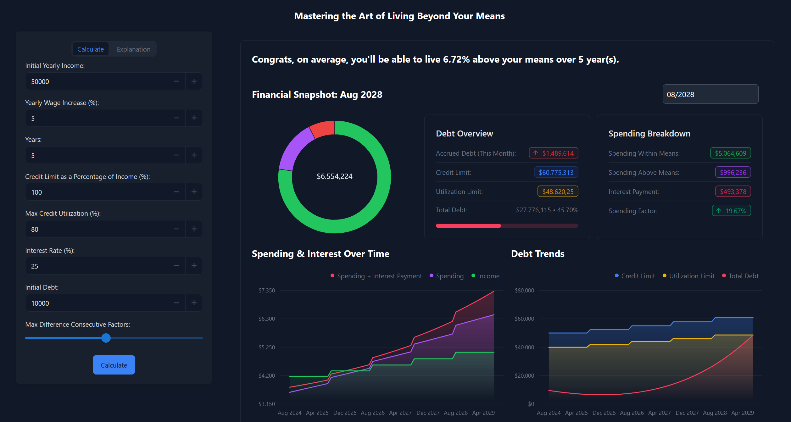

# MutusDebitum: Live Beyond Your Means with Strategic Debt Optimization

**Welcome to MutusDebitum!**

MutusDebitum is your ultimate guide to living the high life on borrowed money, of course! Ever wondered how to squeeze every last drop out of your credit card without a care in the world? Our app is here to "help" you master the art of spending way more than you earn. With a sprinkle of humor and a dash of satire, MutusDebitum shows you how to strategically max out your credit and live in glorious, debt-fueled luxury. But beware, after a set period, the chickens will come home to roost, and you'll be left holding the bag of debt, that is!

For those who appreciate the fun in numbers, MutusDebitum also offers a fascinating look at the math behind debt optimization. Dive into the linear programming and see just how far you can push the limits of financial sanity before reality catches up. It's all in good fun... until the bills come due!

Check it out live: [MutusDebitum](http://mutusdebitum.eu)

---

## How It Works

### Frontend and Backend Architecture

MutusDebitum is built using a React frontend that interacts with a Django backend. The frontend provides an intuitive interface for users to input their financial data, while the backend handles the heavy lifting, using linear programming techniques to "optimize" your spending.

- **Frontend (React):** The frontend is responsible for collecting user inputs such as income, spending limits, and other financial parameters. It communicates with the backend via API calls to perform the optimization calculations and displays the results in a user-friendly way.
  
- **Backend (Django):** The Django backend is the core of MutusDebitum. It processes the input data and runs a linear programming model to find the optimal spending strategy that maximizes the user's ability to live beyond their means. The backend also serves the compiled React frontend, ensuring a seamless user experience.

### The Mathematics Behind the Madness

The essence of MutusDebitum lies in its approach to financial optimization. Here’s how we do it:

#### **Objective: Maximize Your Spending Beyond Your Income**

We aim to strategically use debt to optimize your spending beyond your income. The key metric we focus on is the **spending factor** for each month, denoted by:

$$ f_i = \frac{\text{Spending}_i}{\text{Income}_i} $$

Where $f_i$ represents the ratio of spending (excluding interest) to income in month $i$. The goal is to achieve $f_i > 1$, indicating that spending exceeds income.

#### **Linear Programming Model**

We formulate this problem as a Linear Programming (LP) model, where the objective function is to maximize the sum of the spending factors across all months:

$$ \text{Maximize} \sum_{i=1}^{n} f_i $$

**Subject to the following constraints:**

1. **Debt Accumulation:**
   
   $d_1 = d_0 + (f_1 \cdot \text{Income}_1) - \text{Income}_1$
   
   $`d_i = d_{i-1} + (f_i \cdot \text{Income}_i) - \text{Income}_i + (d_{i-1} \cdot \text{Monthly Interest Rate}), \forall i > 1`$
   
   Here, $d_i$ represents the total debt accrued in month $i$, accumulating from the previous month's debt, current month’s spending, and any interest on the existing debt.

3. **Credit Limit Constraint:**
   
   $d_i \leq \text{Annual Credit Limit} \cdot \text{Max Credit Utilization}, \forall i$

5. **Spending Factor Bounds:**
   
   $-10 \leq f_i \leq 10, \forall i$

7. **Spending Consistency:**
   
   $|f_{i+1} - f_i| \leq \text{Max Difference}, \forall i$

This constraint ensures that spending does not vary too drastically between months, which would otherwise result in erratic financial behavior, especially when interest rates are low or zero.

### Deployment on Google Cloud

MutusDebitum is deployed on Google Cloud using the following architecture:

- **Google Cloud Run**: The application is containerized and deployed using Google Cloud Run, providing a scalable, serverless platform for handling requests.
- **Google Cloud Load Balancing**: Traffic to MutusDebitum is managed by Google Cloud Load Balancing, ensuring high availability and distribution of traffic across multiple instances.
- **Google-Managed SSL**: The site is secured with a Google-managed SSL certificate, ensuring that all communications are encrypted and secure.

### Why It’s All in Good Fun

MutusDebitum is not intended to be serious financial advice. Instead, it’s a playful exploration of how mathematical optimization techniques can be applied to personal finance albeit in a way that might lead you to financial ruin if taken seriously! We encourage you to enjoy the app, learn a bit about linear programming, and most importantly, not actually try to live beyond your means.

### Example

